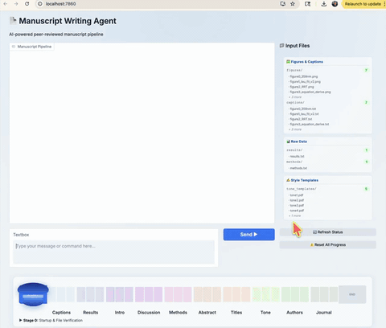

# Manuscript Writing Agent

AI-powered agentic pipeline for drafting peer-reviewed journal manuscripts. Built on Claude (Anthropic API) with a Gradio web UI.



## Quick Start

```bash
cd sci-writer
pip install -r requirements.txt
source .env
python3 app.py
```

Then open http://localhost:7860

## Folder Structure

```
sci-writer/
├── app.py                    # Main Gradio app — run this
├── stages/                   # One module per pipeline stage
│   ├── stage0_verify.py      # File verification & matching
│   ├── stage1_captions.py    # Figure captions (Claude Vision)
│   ├── stage2_results.py     # Results section
│   ├── stage3_intro.py       # Introduction + web search
│   ├── stage4_discussion.py  # Discussion
│   ├── stage5_methods.py     # Materials & Methods
│   ├── stage6_abstract.py    # Abstract
│   ├── stage7_titles.py      # Title suggestions
│   ├── stage8_tone.py        # Tone rewriting from templates
│   ├── stage9_authors.py     # Authorship & affiliations
│   └── stage10_journal.py    # Journal formatting
├── utils/
│   ├── claude_client.py      # Anthropic API wrapper
│   ├── doc_builder.py        # python-docx helpers
│   ├── figure_checker.py     # Pillow image validation
│   └── state_manager.py      # state.json persistence
├── input/
│   ├── figures/              # Drop figure images here
│   ├── captions/             # Drop .txt captions here (same base name as figures)
│   ├── results/              # Drop results .txt files here
│   ├── methods/              # Drop methods .txt files here
│   └── tone_templates/       # Optional: up to 5 .pdf/.docx papers for tone analysis
├── output/                   # Generated files (auto-created)
│   ├── manuscript_draft.docx
│   ├── manuscript_toned.docx
│   ├── manuscript_final.docx
│   ├── figures_captions.docx
│   ├── references.md
│   ├── tone.md
│   └── state.json
└── requirements.txt
```

## Pipeline Stages

| Stage | Name | Description |
|-------|------|-------------|
| 0 | Startup & Verification | Check files, figure↔caption matching, size warnings |
| 1 | Figure Captions | Claude Vision generates journal-style captions |
| 2 | Results | Draft Results from your results/ notes |
| 3 | Introduction | Web search → bullet list → user selects → 800–2000 word Introduction with 30+ refs |
| 4 | Discussion | Connect results + literature; optional merge with Results |
| 5 | Materials & Methods | Draft from methods/ files with sanity checks |
| 6 | Abstract | Structured 150–300 word abstract |
| 7 | Titles | 5–8 title suggestions; user picks one |
| 8 | Tone Rewriting | Analyze tone_templates/ → rewrite manuscript in author's voice |
| 9 | Authorship | Format authors, affiliations, corresponding author |
| 10 | Journal Formatting | Look up journal style → reformat references → final .docx |

## Key Rules

- **No hallucination** — only writes from supplied files or verified web search results
- **Stage gating** — waits for explicit `confirm` before advancing
- **Resumable** — progress saved in `output/state.json`; re-run app.py to resume

## Dependencies

```
anthropic, python-docx, pillow, gradio, pymupdf, tiktoken
```
